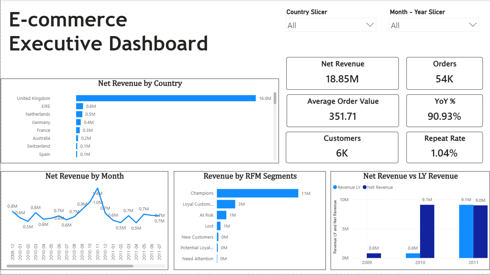
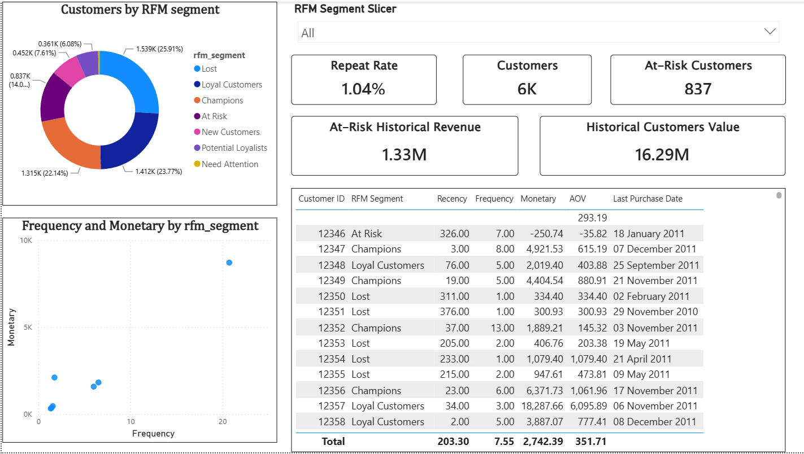
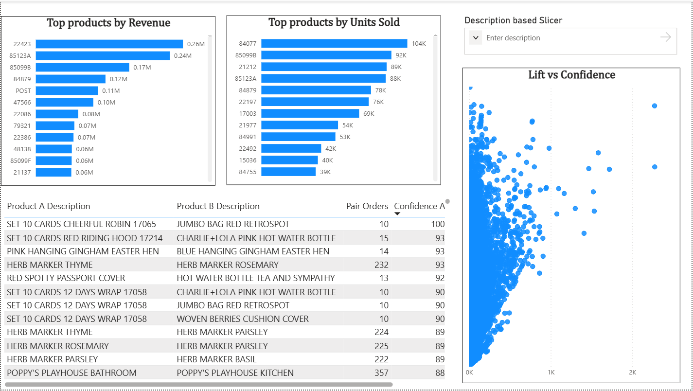

# E-Commerce Executive Dashboard

An end-to-end e-commerce analytics project built on the **Online Retail II** transactional dataset.

The completed Power BI dashboard consists of three interactive pages covering executive performance, customer intelligence, and product/market-basket analysis.

### 1. Executive Overview

Provides a high-level view of business performance, including:

- Net Revenue
- Orders
- Customers
- Average Order Value (AOV)
- YoY Revenue %
- Repeat Rate
- Revenue by Country
- Monthly Net Revenue Trend
- Revenue by RFM Segment
- Net Revenue vs Last Year Revenue



---

### 2. Customer Intelligence

Provides customer-level analysis using RFM segmentation and purchasing behavior.

Key components include:

- Customer count
- Repeat Rate
- At-Risk Customers
- At-Risk Historical Revenue
- Historical Customer Value
- Customer distribution by RFM segment
- Frequency vs Monetary analysis
- Customer-level RFM details
- Recency, Frequency, Monetary value, and AOV
- Last Purchase Date



---

### 3. Product & Market Basket Analysis

Provides product performance and association-rule analysis.

Key components include:

- Top Products by Revenue
- Top Products by Units Sold
- Product description slicer
- Product-pair analysis
- Pair Orders
- Confidence
- Lift
- Lift vs Confidence visualization



---

## Project Overview

The project follows a layered analytics architecture:

```text
Raw Online Retail II Dataset
            |
            v
   Python Data Profiling
            |
            v
     Python Data Cleaning
            |
            v
    Python Data Validation
            |
            v
      PostgreSQL Layer
            |
   +------------------+
   v                  v
Dimensional Model   SQL Analysis
   |                   |
   +-------------------+
            |
            v
       Power BI Model
            |
            v
  Executive Dashboard
            |
            v
   Business Insights
```

The analytical workflow separates data preparation, database modeling, analytical SQL, and dashboard presentation so that business metrics can be traced back to validated transaction data.

---

## Dataset

**Dataset:** Online Retail II

**Link to Dataset:** Online Retail II[https://archive.ics.uci.edu/dataset/502/online+retail+ii]

The raw dataset contains **1,067,371 rows** and **8 columns**, covering transactions from:

- **Start:** 2009-12-01 07:45:00
- **End:** 2011-12-09 12:50:00

### Source Columns

- `Invoice`
- `StockCode`
- `Description`
- `Quantity`
- `InvoiceDate`
- `Price`
- `Customer ID`
- `Country`

The data contains normal sales transactions alongside cancellations, returns/adjustments, fees, discounts, samples, gift-related records, accounting entries, and other operational transactions. The cleaning process therefore distinguishes between legitimate business activity and records unsuitable for analytical calculations rather than treating every unusual value as an error.

---

## Data Quality & Cleaning

### Key Data-Quality Findings

The initial profiling identified:

| Finding                                 | Result    |
|-----------------------------------------|----------:|
| Raw rows                                | 1,067,371 |
| Exact duplicate rows                    | 34,335    |
| Missing Customer IDs                    | 243,007   |
| Missing descriptions                    | 4,382     |
| Cancellation-related invoices           | 19,494    |
| Non-cancelled negative-quantity records | 3,457     |
| Zero-price records                      | 6,202     |
| Unique StockCodes                       | 5,305     |
| Unique countries                        | 43        |

Special StockCodes and transaction types were investigated individually. Financial and operational codes such as `POST`, `D`, `M`, `BANK CHARGES`, `ADJUST`, `AMAZONFEE`, and `CRUK` were retained because they can represent monetary activity.

Explicit test/non-analytical records were excluded:

- `TEST001`
- `TEST002`
- `GIFT`
- `DCGSLGIRL`
- `DCGSLBOY`

### Cleaning Results

| Measure                  | Result        |
|--------------------------|--------------:|
| Raw rows                 | 1,067,371     |
| Exact duplicates removed | 34,335        |
| Explicitly excluded rows | 20            |
| Final cleaned rows       | **1,033,016** |

The cleaning process also:

- standardized column names and data types
- preserved nullable `customer_id` values
- normalized StockCode casing
- normalized the single cancellation record containing a positive quantity
- classified transactions as `Cancelled`, `Return/Adjusted`, or `Completed`
- retained legitimate financial and operational transactions
- retained missing customer IDs and descriptions
- created transaction date, time, month, and year fields
- calculated Gross Revenue, Return Value, and Net Revenue

### Revenue Definition

Revenue is calculated at transaction-line level:

```text
Gross Revenue = quantity * unit_price for non-negative quantities
Return Value  = ABS(quantity * unit_price) for negative quantities
Net Revenue   = Gross Revenue - Return Value
```

The SQL layer independently re-derived these values from `quantity` and `unit_price` to provide a cross-layer reconciliation check.

---

## PostgreSQL Data Layer

The cleaned CSV is loaded into a staging table before being transformed into the analytical model.

### Staging

```text
staging_transactions
```

The staging layer contains **1,033,016 rows**, matching the Python validation result.

Null checks also reconcile between Python and PostgreSQL for the documented fields.

### Analytical Model

The PostgreSQL model consists of one fact table and four core dimensions:

```text
                    fact_sales
                        |
        +---------------+---------------+---------------+
        |               |               |               |
  dim_customer     dim_product      dim_date       dim_country
```

Additional customer-level analytical tables support the Power BI model:

- `customer_summary`
- `rfm_segments`
- `market_basket_results`

### Fact Grain

**One row = one transaction line for one invoice and one product.**

`fact_sales` contains:

| Metric | Value |
|---|---:|
| Fact rows | 1,033,016 |
| Distinct orders | 53,608 |
| Distinct customers | 5,940 |
| Distinct products | 5,300 |
| Net Revenue | 18,854,583.058 |
| Minimum transaction date | 2009-12-01 |
| Maximum transaction date | 2011-12-09 |

The fact-table grain check returned zero duplicate rows for the documented invoice/product grain.

---

## SQL Analysis

The PostgreSQL analytical layer covers:

1. Revenue analysis
2. Customer concentration
3. RFM segmentation
4. Retention analysis
5. Product performance
6. Market basket analysis
7. Geographic analysis

### Overall Revenue Metrics

| Metric | Value |
|---|---:|
| Gross Revenue | 20,317,358.308 |
| Returns | 1,462,775.250 |
| Net Revenue | **18,854,583.058** |
| Orders | 53,608 |
| Customers | 5,940 |
| Units Sold | 10,886,618 |
| AOV | 351.71 |
| Revenue per Customer | 3,174.17 |
| Orders per Customer | 9.02 |

### Revenue Trend

Net revenue declined from **796,535.00** in December 2009 to **432,719.06** in December 2011, a documented decline of **45.68%**.

The most recent documented month also shows:

- **MoM growth:** -70.28%
- **YoY growth:** -42.05%

The available methodology does not provide sufficient period-start/period-end decomposition of customers, orders per customer, and AOV to attribute the overall decline to one specific driver.

---

## Customer Intelligence

Revenue is highly concentrated among a relatively small group of customers:

| Customer Group | Revenue Share |
|---|---:|
| Top 1% | 31.42% |
| Top 5% | 51.69% |
| Top 10% | 63.88% |
| Top 20% | 77.60% |

Additional customer metrics:

- Average revenue per customer: **2,742.39**
- Median revenue per customer: **823.05**
- Maximum revenue from a single customer: **570,380.61**

### RFM Segmentation

RFM scoring is calculated in PostgreSQL and exposed to Power BI rather than being independently recalculated in DAX.

Reference date:

```text
2011-12-10
```

| Segment | Customers | Segment Revenue |
|---|---:|---:|
| Champions | 1,315 | 11,464,973.405 |
| Loyal Customers | 1,412 | 2,584,409.347 |
| At Risk | 837 | 1,331,570.632 |
| Potential Loyalists | 1,539 | 511,872.312 |
| Need Attention | 452 | 210,772.300 |
| New Customers | 361 | 135,429.891 |
| Lost | 24 | 50,759.901 |

The documented At-Risk segment contains **837 customers** and **1.33M** in historical revenue.

The business implication is that retention efforts should prioritize **high-value At-Risk customers**, rather than treating every At-Risk customer as equally valuable.

---

## Product Analysis

The leading products differ depending on the commercial objective:

| Rank | Revenue | Units | Customer Reach |
|---|---|---|---|
| 1 | REGENCY CAKESTAND 3 TIER | WORLD WAR 2 GLIDERS ASSTD DESIGNS | WHITE HANGING HEART T-LIGHT HOLDER |
| 2 | WHITE HANGING HEART T-LIGHT HOLDER | WHITE HANGING HEART T-LIGHT HOLDER | REGENCY CAKESTAND 3 TIER |
| 3 | JUMBO BAG RED RETROSPOT | JUMBO BAG RED RETROSPOT | BAKING SET 9 PIECE RETROSPOT |

The analysis therefore distinguishes between:

- revenue generation
- unit volume
- customer reach

rather than using one product ranking for every commercial decision.

---

## Market Basket Analysis

Market Basket Analysis uses:

```text
transaction_status = 'Completed'
AND is_admin_code = FALSE
```

A minimum pair-count threshold of **10 orders** is applied.

The pair-counting logic uses:

```text
a.stock_code < b.stock_code
```

to prevent unordered product pairs from being counted twice.

Selected high-association pairs include:

| Product A | Product B | Pair Orders | Confidence | Lift |
|---|---|---:|---:|---:|
| 23632 | 85099B | 10 | 100.00% | 10.3726 |
| 85049a | 85099C | 49 | 96.08% | 21.3080 |
| 23611 | 84032A | 15 | 93.75% | 58.6688 |
| 84745A | 84745B | 14 | 93.33% | 2,274.4784 |
| 22916 | 22917 | 232 | 93.17% | 153.1729 |

These associations are candidates for targeted cross-sell and bundle testing. The analysis does not assume that association automatically produces incremental revenue; commercial impact requires measurement.

---

## Geographic Analysis

The United Kingdom is the leading revenue market:

| Country | Revenue | Customers | Orders | AOV | Revenue / Customer |
|---|---:|---:|---:|---:|---:|
| United Kingdom | 15,985,109.697 | 5,408 | 49,088 | 325.64 | 2,955.83 |
| EIRE | 609,953.780 | 5 | 806 | 756.77 | 121,990.76 |
| Netherlands | 548,330.700 | 23 | 250 | 2,193.32 | 23,840.47 |
| Germany | 411,959.161 | 107 | 1,095 | 376.22 | 3,850.09 |
| France | 321,733.390 | 95 | 746 | 431.28 | 3,386.67 |

The UK represents the strongest revenue-scale market.

The EIRE revenue-per-customer figure is exceptionally high but is based on only **5 customers**, so it should be treated as a small-sample signal rather than a representative market benchmark.

---

## Power BI Semantic Model

Power BI imports the analytical PostgreSQL tables:

- `fact_sales`
- `dim_customer`
- `dim_product`
- `dim_date`
- `dim_country`
- `customer_summary`
- `rfm_segments`
- `market_basket_results`

Intermediate tables such as `staging_transactions` and `clean_transactions` are not imported.

### Relationships

```text
                        fact_sales
                            |
      +--------------+-------------+------------+
      |              |             |            |
dim_product    dim_customer    dim_date    dim_country
                     |
            +-----------------+
            |                 |
    customer_summary     rfm_segments
```

`dim_date` is configured as the model Date Table.

RFM scoring and segment assignment remain owned by PostgreSQL. Power BI exposes the resulting values rather than implementing duplicate scoring logic in DAX.

---

## Power BI Dashboard

The completed dashboard contains three pages.

### 1. Executive Overview

Business question:

> How is the business performing?

Key visuals:

- Net Revenue
- Orders
- Customers
- AOV
- Repeat Rate
- YoY %
- Monthly revenue trend
- YoY comparison
- Revenue by RFM segment
- Top products by revenue
- Revenue by country

Documented dashboard KPI values include:

| KPI | Value |
|---|---:|
| Net Revenue | 18.85M |
| YoY % | 90.93% |
| Repeat Rate | 1.04% |
| Top country by revenue | United Kingdom |
| Top product by revenue | Regency Cakestand 3 tier |

The dashboard-level YoY KPI and the monthly SQL YoY metric answer different analytical views and should not be interpreted as the same calculation.

### 2. Customer Intelligence

Business question:

> Who generates value, and who is at risk?

Key visuals:

- Customer KPIs
- Historical Customer Value
- Repeat Rate
- At-Risk Customers
- At-Risk Historical Revenue
- RFM segment distribution
- Frequency vs. Monetary scatter
- Customer detail table

### 3. Product & Market Basket

Business question:

> What should we sell together?

Key visuals:

- Top products by revenue
- Top products by units
- Product-pair table
- Confidence vs. Lift scatter

### Dashboard Slicers

| Slicer | Page |
|---|---|
| `dim_date[year_month]` | Executive Overview |
| `dim_country[country]` | Executive Overview |
| `rfm_segments[rfm_segment]` | Customer Intelligence |
| `dim_product[description]` | Product & Market Basket |

---

## Reconciliation & Validation

### Python → PostgreSQL

The documented reconciliation confirms:

| Metric | Result |
|---|---|
| Gross Revenue | PASS |
| Return Value | PASS |
| Net Revenue | PASS |
| Distinct Orders | PASS |
| Distinct Products | PASS |
| Exact Duplicate Check | PASS |

Revenue reconciliation:

```text
20,317,358.308 - 1,462,775.250
= 18,854,583.058
```

### Important Customer-Count Reconciliation Note

There is one documented cross-layer discrepancy that should remain visible rather than being silently treated as a pass:

- Python validation documents **5,941** distinct customers in the cleaned dataset.
- The PostgreSQL `fact_sales` layer documents **5,940** distinct customers.
- Power BI reconciles to the PostgreSQL figure of **5,940**.

The supplied documentation does not establish the exact cause of this one-customer difference. Therefore, the final project documentation records it as an outstanding reconciliation discrepancy rather than claiming a full customer-count pass.

### PostgreSQL → Power BI

The documented dashboard reconciliation reports matching results for the tested KPIs and filtered spot-checks:

- unfiltered KPI comparisons
- date + country filtered spot-check
- slicer propagation across page visuals

Documented matching metrics include Net Revenue, Orders, Customers, Units Sold, AOV, top-country revenue, top-product revenue, At-Risk customer count, and At-Risk historical revenue.

---

## Business Insights

### Revenue

The business generated approximately **18.85M in net revenue** across the documented dataset.

However, the final month shows a significant decline:

- -70.28% MoM
- -42.05% YoY

The documented analysis does not support attributing this decline to customers, orders per customer, or AOV individually.

### Customer Retention

Revenue is strongly concentrated:

- Top 10% of customers generate **63.88%** of revenue.
- 837 customers are classified as At Risk.
- At-Risk customers represent approximately **1.33M** of historical revenue.

This creates a clear retention exposure, particularly among high-value customers.

### Product Strategy

No single product dominates revenue, units, and customer reach simultaneously. Product decisions should therefore be aligned to the specific objective: value, volume, or reach.

### Cross-Sell

The strongest observed product associations provide concrete candidates for:

- checkout recommendations
- cross-sell prompts
- product bundles

These should be validated through controlled measurement rather than assuming high lift or confidence guarantees incremental revenue.

### Geography

The United Kingdom is the primary revenue-scale market.

Small-market metrics, particularly EIRE's very high revenue per customer, require cautious interpretation because of the small underlying customer base.

---

## Repository Structure

```text
e-commerce-executive-dashboard/
│
├── data/
│   ├── raw/
|   ├── processed/
│   └── cleaned/
│
├── python/
|   ├── 00_data_conversion.ipynb
│   ├── 01_data_profiling.ipynb
│   ├── 02_data_cleaning.ipynb
│   └── 03_data_validation.ipynb
│
├── sql/
|   ├── 01_database_setup.sql
│   ├── 02_raw_load.sql
│   ├── 03_clean_transactions.sql
│   ├── 04_dimensions.sql
│   ├── 05_fact_sales.sql
│   ├── 06_revenue_analysis.sql
│   ├── 07_customer_analysis.sql
│   ├── 08_rfm_analysis.sql
│   ├── 09_retention_analysis.sql
│   ├── 10_product_analysis.sql
│   ├── 11_market_basket.sql
│   └── 12_geographic_analysis.sql
│
├── powerbi/
│
├── documentation/
│   ├── power bi/
|   ├── sql/
|   |      └── postgresql_layer.md
|   ├── python/
|   |      └── python_layer.md
│   └── business_insights.md
|    
├── images/
|   ├── 01_executive_overview.png
|   ├── 02_customer_intelligence.png
|   └── 03_product_&_market_basket.png
|
├── .gitignore
└── README.md
```

---

## Technology Stack

- **Python**
- **Pandas**
- **PostgreSQL**
- **SQL**
- **Power BI**
- **Git**
- **GitHub**

---

## Project Completion Status

**Status: Completed**

The documented project lifecycle is complete:

- [x] Data profiling
- [x] Data quality investigation
- [x] Data cleaning
- [x] Data validation
- [x] PostgreSQL database setup
- [x] PostgreSQL analytical model
- [x] SQL analytical queries
- [x] Revenue analysis
- [x] Customer and RFM analysis
- [x] Retention analysis
- [x] Product analysis
- [x] Market Basket Analysis
- [x] Geographic analysis
- [x] Power BI semantic model
- [x] Three-page Power BI dashboard
- [x] Dashboard reconciliation
- [x] Business insights
- [x] Project documentation

The project demonstrates an end-to-end analytics workflow from raw transactional data through data quality engineering, relational modeling, analytical SQL, semantic modeling, dashboarding, reconciliation, and business interpretation.
